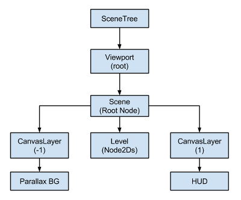

# 1. 使用视差背景ParallaxBackground

- [timothyqiu大教程 如何实现视差背景滚动【Godot教程】](https://www.bilibili.com/video/BV1iK411K7q2/?spm_id_from=333.788&vd_source=4f3b881aea002f58e78c896adbef428d)

# 2. 制作转场动画CanvasLayer

- 它是一个节点, 为所有子代和孙代添加一个单独的2D渲染层.
- Viewport的子节点默认在图层 "0 " 处绘制, 而CanvasLayer将在任何数字层处绘制.
- 数字较大的图层将绘制在数字较小的图层之上.CanvasLayers也有自己的变换, 不依赖于其他层的变换.
- 这使得当我们对游戏世界的观察发生变化时,UI可以固定在屏幕空间中.



- [CanvasLayer节点](https://www.bilibili.com/video/BV14Y411h7Po?p=96&vd_source=4f3b881aea002f58e78c896adbef428d)
- [timothyqiu大教程 如何实现角色死亡和简单转场【Godot教程】](https://www.bilibili.com/video/BV1fz4y1k78W/?spm_id_from=pageDriver&vd_source=4f3b881aea002f58e78c896adbef428d)


- 需要注意的一点是，godot4.x已经没有晦涩难懂的margin了，完全用位置替代，

- await 新语法

```
yield(object, signal) == await object.signal
```

# 3. 优化转换场景的方法

- 使用Autoload把Main当作全局的脚本控制
- 使用change_scene_to_file替换之前的add_child方式切换场景
